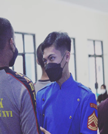
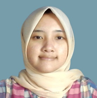

# Salman Akbar Hasbullah 

## Bio

Lahir di Bandung pada tahun 2001, Alman Akbar Hasbullah merupakan anak kedua dari dua bersaudara.

## Pendidikan

- SD Mutiara, Bandung (2008-2011)
- SDN 1 Tambakmulyo, Kebumen, Jawa Tengah (2011-2014)
- SMP N 2 Puring (2014-2017)
- SMK N 1 Puring, Jurusan Nautika Kapal Penangkap Ikan (2017-2020)

## Aktivitas Sekolah

Selama pendidikan menengah, aktif di:
- Organisasi intra-sekolah (staf ketarunaan)
- Kepramukaan sebagai Ketua Dewan Ambalan

## Karier Awal

Memulai karier sebagai pelaut di Pelabuhan Perikanan Samudra Pekalongan.

## Pendidikan Tinggi

Melanjutkan pendidikan D4 Teknik Informatika di Universitas Logistik Dan Bisnis Internasional (2021-2025).

## Motivasi Pilihan Jurusan

Meskipun tanpa dasar pemrograman, keinginan untuk mempelajari dan mempraktekkan ilmu Teknik Informatika mendorongnya. Kesadaran akan pentingnya literasi teknologi informasi bagi kehidupan industri dan sosial juga menjadi motivasi.

## Prestasi Selama Kuliah

- Menyelesaikan proyek prediksi harga dengan pendekatan Machine Learning.
- Mempelajari Bahasa pemrograman: PHP, Python, Java, dan C#.
- Ketekunan, motivasi, dan keinginan belajar yang tinggi.

## Harapan

Dengan capaian yang telah diraih, Alman berharap kontribusinya dapat memberikan dampak positif, terutama di dunia pendidikan.

---

# Shinta Raudita Octora Damayanti

## Bio

Lahir di Kota Bandung pada tahun 2002, Raudita Octora Damayanti adalah anak kedua dari dua bersaudara.

## Pendidikan

- SDN Cimahi Mandiri 2, Kota Cimahi (2009-2015)
- SMPN 47 Bandung (2015-2018)
- SMA Pasundan 3 Cimahi, Jurusan Ilmu Pengetahuan Alam (2018-2021)

## Aktivitas Sekolah

Selama pendidikan menengah, aktif di:
- English Club
- Badminton Club
- Swimming Club

## Perguruan Tinggi

Melanjutkan pendidikan D4 Teknik Informatika di Universitas Logistik dan Bisnis Internasional (2021-2025).

## Motivasi Pilihan Jurusan

Tanpa dasar pemrograman sebelumnya, keinginan untuk memahami cara internet dan website bekerja menjadi latar belakang. Selama pandemi COVID-19, menyadari bahwa kehidupan sehari-hari tak lepas dari teknologi, mendorong literasi teknologi untuk kehidupan sehari-hari.

## Prestasi Selama Kuliah

- Menyelesaikan proyek prediksi harga dengan pendekatan Machine Learning.
- Penguasaan bahasa pemrograman: JavaScript, Python, PHP, Java, dan C#.
- Motivasi belajar tinggi.

## Harapan

Dengan pencapaian yang diraih, Raudita berharap dapat memberikan kontribusi bagi masyarakat, khususnya di bidang pendidikan.

---

# Rolly Maulana Awangga

## Bio

Lahir di Kota Indramayu pada tanggal 10 November 1986, Olly Maulana Awangga menghabiskan pendidikan tingkat dasar hingga menengah di Indramayu.

## Pendidikan

- SMA di SMANDA Cirebon (Merantau sejak SMA)
- S1 di STT Telkom
- S2 di IT Telkom Bandung

## Aktivitas Sekolah dan Kuliah

Selama sekolah dan kuliah, aktif di:
- PPS Betako Merpati Putih (SMA)
- Pengurus OSIS (SMA)
- Pendiri Dewan Keamanan Sekolah (SMA)
- TLH Telkom (Kuliah)
- Pengurus Klub Linux Bandung (Kuliah)
- Pengurus Bandung Kota Blogger (Kuliah)
- Pendiri Saung IT (Kuliah)
- Wartawan Pikiran Rakyat (Kuliah)

## Karier

- Tenaga Ahli dan Konsultan di aplikasi SDDKN Sekretariat Negara
- Aplikasi Kementrian Hukum dan Ham
- Team DevOps Pekan Olahraga Nasional
- Cloud Architect Aplikasi Asesment Madrasah Kementrian Agama

---

 